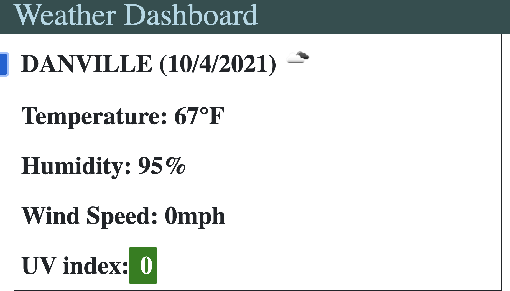

# Weather Dashboard

<!-- TABLE OF CONTENTS -->
<details open="open">
  <summary>Table of Contents</summary>
  <ol>
    <li>
      <a href="#about-the-project">About The Project</a>
      <ul>
        <li><a href="#built-with">Built With</a></li>
      </ul>
    </li>
    <li>
      <a href="#getting-started">Getting Started</a>
    </li>
    <li><a href="#code-snippet">Code-Snippet</a></li>
    <li><a href="#license">License</a></li>
    <li><a href="#contact">Contact</a></li>
    <li><a href="#acknowledgements">Acknowledgements</a></li>
  </ol>
</details>


<!-- ABOUT THE PROJECT -->
## About The Project



For this assignment, I had to create a day planner from scratch. Nothing was provided, so this was a true test to my knowledge and what I've learned so far. For this planner, it need to be updated every second witht the correct time and date or unless the JS wouldn't work. I creates fields by the hour, 9am-5pm, where you can save things to do with the appropiate time and save it. The field will turn white when that time has passed for the day. Of course, making this planner wasn't easy. It tested my previous knowledge and I was constantly researching to ensure I had the best planner I could deliver to the user!

The websites I used to help create my day planner are listed below in the <a href="#acknowledgements">acknowledgements</a>.

### Built With

I used <a href="https://code.visualstudio.com/">Visual Studio Code</a> to create the HTML, CSS and Javascript from scratch. I had the help of Bootstrap for formatting the HTML and JQuery to help with the coding on the Javascript!


<!-- GETTING STARTED -->
## Getting Started

This webpage is up-to-date every second with the time and date and will allow you to to see the current weather. You can change the location through the search bar and clicking search. Depending on what the UV Index is, an appropiate color will display for the UV Index.


<!-- USAGE EXAMPLES -->
## Code Snippet

While coding this weather dashbaord, this piece of code / function proved to be the hardest to figure out. I had to create different variables that would all go into one '$' and creating an 'img' tag was the hardest. It was the hardest because my webpage would display the link rather than the icon and i was through trial and error, I found out the correct formation. This part of the javascript wasn't easy but it was fun because of the challenge!
```
var cityN = city.toUpperCase()
var date = new Date(response.dt*1000).toLocaleDateString();
var icon = response.weather[0].icon;
var iconImage = ""
$(".city-name").html(" " + cityN + " (" + date + ") " + iconImage)
```


<!-- LICENSE -->
## License

Distributed under the MIT License. See `LICENSE` for more information.


<!-- CONTACT -->
## Contact

Sami Khawja - Skhawja11@gmail.com

Project Link: [GitHub](https://github.com/samikhawja/weather_dashboard)

Live Link: [Weather Dashboard](https://samikhawja.github.io/weather_dashboard/)


<!-- ACKNOWLEDGEMENTS -->
## Acknowledgements
* Taylor Hackbart
* Vince Lee
* [W3Schools](https://www.w3schools.com/)
* [StackOverflow](https://stackoverflow.com/)
* [Mozilla](https://developer.mozilla.org/en-US/docs/Web/JavaScript)
* [Bootstrap](https://getbootstrap.com/)
* [JQuery](https://jquery.com/)